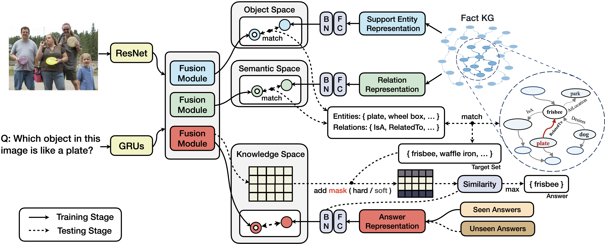

# ZS-F-VQA


[](https://github.com/China-UK-ZSL/ZS-F-VQA/blob/main/LICENSE)
[](http://arxiv.org/abs/2107.05348)

 

## 基础知识VQA处理流程


## 🔔  文章来源: Zero-shot Visual Question Answering using Knowledge Graph

[ISWC 2021 ](https://arxiv.org/abs/2107.05348), or url: https://arxiv.org/abs/2107.05348

> [!IMPORTANT]
>
> Abstract: 
> In this work, we propose a Zero-shot VQA algorithm using knowledge graphs and a mask-based learning mechanism for better incorporating external knowledge, and present new answer-based Zero-shot VQA splits for the F-VQA dataset.

## 🔔 新闻

- `2024-02`We preprint our Survey at arxiv: [Knowledge Graphs Meet Multi-Modal Learning: A Comprehensive Survey](http://arxiv.org/abs/2402.05391); or https://arxiv.org/abs/2402.05391
  
- [`Repo for the servey `](https://github.com/zjukg/KG-MM-Survey), or https://github.com/zjukg/KG-MM-Survey

## 🔔 模型架构



## 🔔 使用说明

### 1   系统需要

```
python >= 3.5
PyTorch >= 1.6.0
```

For more detail of requirements:  
`cmd/bash> pip install -r requirements.txt`

my version (python3.10.5):

```
h5py==3.10.0
easydict==1.13
numpy==1.26.4
tqdm==4.50.2
Unidecode==1.3.8<br>
nltk==3.5<br>
matplotlib==3.8.3<br>
wordninja==2.0.0<br>
torch==2.2.2<br>
torchvision==0.17.2<br>
pandas==2.2.1<br>
six==1.16.0<br>
Pillow==10.3.0<br>
python_Levenshtein==0.25.0<br>
SciencePlots==2.1.1<br>
Levenshtein==0.25.0<br>
tensorboard==2.16.2<br>
pytest==8.1.1<br>
pytest-mock==3.14.0
```

### 2. 数据准备

1.  **Location of 5 F-VQA train / test data split:<br>**

- ```data/KG_VQA/fvqa/exp_data/train_data```  <br>
  //训练集已发放, 如: all_qs_dict_release_train.json, all_qs_dict_release_train_500.json
- ```data/KG_VQA/fvqa/exp_data/test_data```  <br>
  //测试集已发放, 如: all_qs_dict_release_test.json, all_qs_dict_release_test_500.json

2. **Location of 5 ZS-F-VQA train / test data split:<br>**

- ```data/KG_VQA/fvqa/exp_data/train_seen_data``` <br>
  //训练集已发放, 如: all_qs_dict_release_train_500.json
- ```data/KG_VQA/fvqa/exp_data/test_unseen_data``` <br>
  //测试集已发放, 如: all_qs_dict_release_test_500.json


3. **Answers are available at ``data/KG_VQA/data/FVQA/new_dataset_release/.`` <br>**
   //答案已发放, 如: all_fact_triples_release.json, all_qs_dict_release.json, all_qs.dict_release_combine.json,
   ans_tntity_map.txt等等

> [!NOTE]
 **训练集和测试集说明**
  **训练集（train_data 和 train_seen_data）：**
  用于训练模型的数据集。这些数据包括图片、相关的问题和正确的答案。模型通过学习这些问题与答案的对应关系，尝试理解和学习如何从给定的图像中提取信息以回答问题。
  train_data 用于常规的训练。
  train_seen_data 在零样本学习（ZSL）的上下文中使用，意味着这部分数据包含了在训练阶段“看到”的样本。 

   **测试集（test_data 和 test_unseen_data）：**
   用于评估模型性能的数据集。这部分数据模型在训练阶段未曾“看到”，目的是测试模型对新问题和图像的回应能力。
   test_data 是常规测试集，用来评估模型在看过的问题类型上的性能。
   test_unseen_data 在零样本学习的场景下使用，包含模型在训练时未见过的问题或概念，用于评估模型泛化能力。"

### 3 图片准备

#### 对Image folder操作

> - `data/KG_VQA/fvqa/exp_data/images/images``` 此处是个空文件夹，
> - put all your `.JPEG`/`.jpg` file here: C:\ZS-F-VQA-main\data\KG_VQA\fvqa\exp_data\images\images <br>
> - 需手动添加h5文件进上述image folder:C:
>   \ZS-F-VQA-main\data\KG_VQA\fvqa\exp_data\images\images\fvqa-resnet-14x14.h5 <br>

#### H5文件解释：

'''
h5文件是resnet预处理预训练后得到的特征信息.HDF5文件顶层包含两个数据集：“features”和“ids”。在许多机器学习数据集中，这是常见的结构.其中features这个数据集可能包含实际的图像数据或从图像中提取的特征。这些数据可能是原始的像素值，也可能是经过某种处理（如特征提取算法处理）后的数值数据。例如，返回值(
10000, 32, 32, 3)表示这是一个四维数组，包含10000个32x32像素大小且色彩通道为3（RGB）的图像。
ids: 这个数据集可能包含与“features”数据集中每个图像或特征向量相对应的标识符。<br>

- 这里，features 数据集维度是 (3016, 2048, 14, 14),这个数据集可能是通过一个CNN（如ResNet）模型得到的，其中包含了 3016
  张图像经过模型处理后的特征图（每张图像对应 2048 个特征，每个特征是一个大小为 14x14 的小图像）:<br>
    - 第一维：包含 3016 个元素，可能代表有 3016 个样本。<br>
    - 第二维：包含 2048 个元素，可能代表每个样本有 2048 个特征。<br>
    - 第三维：包含 14 个元素，配合第四维，可能代表每个特征是一个 14x14 的小图像。'''

- Image feature:
  - `fvqa-resnet-14x14.h5`这个文件从下面网址得到，还需要添加到上面的文件夹去.
    pretrained: [GoogleDrive](https://drive.google.com/file/d/1YG9hByw01_ZQ6_mKwehYiddG3x2Cxatu/view?usp=sharing)
    or [BaiduCloud(password:16vd)](https://pan.baidu.com/s/1ks84AWSXxJJ_7LwnzWdEnQ) https://pan.baidu.com/s/1ks84AWSXxJJ_7LwnzWdEnQ
  - `fvqa36_imgid2idx.pkl` and `fvqa_36.hdf5`
    pretrained: [GoogleDrive](https://drive.google.com/file/d/1wfgmPhNF7DR7_yEAr8lxjtdsko7lLCWj/view?usp=sharing)
    or [BaiduCloud](https://pan.baidu.com/s/11KRiw2jvPBzgd3xUbynHjw?pwd=zsqa) (password:zsqa)

  - Origin images are available at [FVQA](https://github.com/wangpengnorman/FVQA)
    with [download_link](https://www.dropbox.com/s/iyz6l7jhbt6jb7q/new_dataset_release.zip?dl=0).
  - Other vqa dataset: you could generate a pretrained image feature via this
    way ([Guidance](https://github.com/hexiang-hu/answer_embedding/issues/3) / [code](https://github.com/Cyanogenoid/pytorch-vqa/blob/master/preprocess-images.py))
  - The generated `.h` file should be placed in :
    ```data/KG_VQA/fvqa/exp_data/common_data/.```

**Answer / Qusetion vocab:**

- The generated file `answer.vocab.fvqa.json` & `question.vocab.fvqa.json`  now are available at :
  ```data/KG_VQA/fvqa/exp_data/common_data/.```
- Other vqa dataset: code
  for [process answer vocab](https://github.com/hexiang-hu/answer_embedding/blob/master/tools/preprocess_answer.py)
  and [process questions vocab](https://github.com/hexiang-hu/answer_embedding/blob/master/tools/preprocess_question.py)

---

### Pretrained Model ([url](https://www.dropbox.com/sh/vp5asuivqpiir5w/AAC3k_gELrP4ydNNok_o1vlYa?dl=0))

Download it and overwrite ```data/KG_VQA/fvqa/model_save```

### [Parameter](#content)

```
[--KGE {TransE,ComplEx,TransR,DistMult}] [--KGE_init KGE_INIT] [--GAE_init GAE_INIT] [--ZSL ZSL] [--entity_num {all,4302}] [--data_choice {0,1,2,3,4}]
               [--name NAME] [--no-tensorboard] --exp_name EXP_NAME [--dump_path DUMP_PATH] [--exp_id EXP_ID] [--random_seed RANDOM_SEED] [--freeze_w2v {0,1}]
               [--ans_net_lay {0,1,2}] [--fact_map {0,1}] [--relation_map {0,1}] [--now_test {0,1}] [--save_model {0,1}] [--joint_test_way {0,1}] [--top_rel TOP_REL]
               [--top_fact TOP_FACT] [--soft_score SOFT_SCORE] [--mrr MRR]
```

Available model for training: ```Up-Down```, `BAN`, `SAN`, `MLP`

**You can try your own model via adding it (`.py`) to :** `main/code/model/.`

For more details: ```code/config.py```

---

### Running

```cd code```

**For data check:**

- ```python deal_data.py --exp_name data_check```

**General VQA:**

- train:
  ```bash run_FVQA_train.sh```
- test:
  ```bash run_FVQA.sh```

**ZSL/GZSL VQA:**

- train:
  ```bash run_ZSL_train.sh```
- test:
  ```bash run_ZSL.sh```

**Note**:

- you can open the `.sh` file for <a href="#Parameter">parameter</a> modification.

**Result:**

- Log file will be saved to: ```code/dump```
- model will be saved to: ```data/KG_VQA/fvqa/model_save```

<br />

## Explainable


<br />

## Acknowledgements

Thanks for the following released works:

> [SciencePlots](https://github.com/garrettj403/SciencePlots), [ramen](https://github.com/erobic/ramen), [GAE](https://github.com/zfjsail/gae-pytorch), [vqa-winner-cvprw-2017](https://github.com/markdtw/vqa-winner-cvprw-2017), [faster-rcnn](https://github.com/jwyang/faster-rcnn.pytorch), [VQA](https://github.com/Shivanshu-Gupta/Visual-Question-Answering), [BAN](https://github.com/jnhwkim/ban-vqa), [commonsense-kg-completion](https://github.com/allenai/commonsense-kg-completion), [bottom-up-attention-vqa](https://github.com/hengyuan-hu/bottom-up-attention-vqa), [FVQA](https://github.com/wangpengnorman/FVQA), [answer_embedding](https://github.com/hexiang-hu/answer_embedding), [torchlight](https://github.com/RamonYeung/torchlight)

## Cite:

Please condiser citing this paper if you use the code

```bigquery
@inproceedings{chen2021zero,
  title={Zero-Shot Visual Question Answering Using Knowledge Graph},
  author={Chen, Zhuo and Chen, Jiaoyan and Geng, Yuxia and Pan, Jeff Z and Yuan, Zonggang and Chen, Huajun},
  booktitle={International Semantic Web Conference},
  pages={146--162},
  year={2021},
  organization={Springer}
}
```

For more details, please submit a issue or contact [Zhuo Chen](https://github.com/hackerchenzhuo).
<a href="https://info.flagcounter.com/VOlE"></a>
